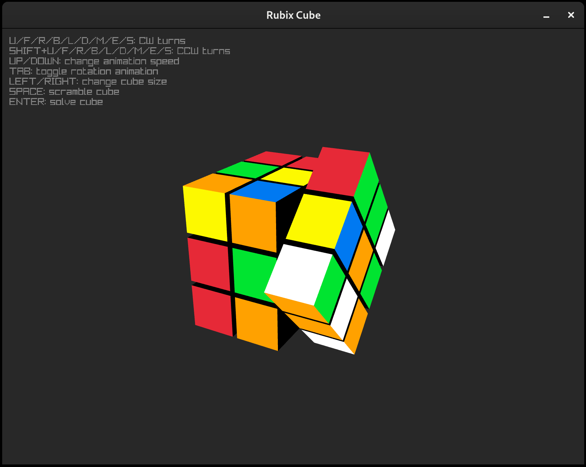

# How it looks





# How to play the game

Clone the repo first and step into the root folder
```
git clone https://github.com/mandliors/Rubik-s-Cube/
cd Rubik-s-Cube
```

Then to build and run
```
mkdir build;cd build
cmake ..
make && ./RubixCube
```
Enjoy!
